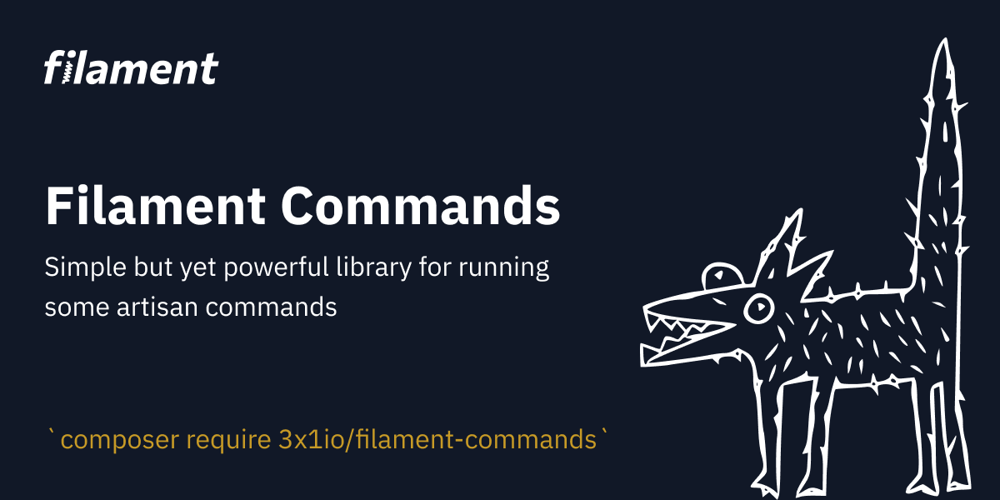

# Filament Artisan Commands GUI

Simple but yet powerful library for running some [artisan](https://laravel.com/docs/8.x/artisan) commands.
this packages is a frok of [artisan-gui](https://github.com/infureal/artisan-gui) with some custome for filament UI

## Installation

You can install the package via composer:

```bash
composer require 3x1io/filament-commands
```

By default package has predefined config and inline styles and scripts. 
Since version `1.4` you can publish vendors like css and js files in `vendor/artisan-gui`:
```bash
php artisan vendor:publish --provider="io3x1\FilamentCommands\FilamentCommandsProvider"
```
Publish only config: 
```bash
php artisan vendor:publish --tag="artisan-gui-config"
```

Publish only styles and scripts: 
```bash
php artisan vendor:publish --tag="artisan-gui-css-js"
```

## Running command
By default, you can access this page only in local environment. If you wish
you can change `local` key in config. 

Simply go to `http://you-domain.com/admin/artisan` and here we go! 
Select needed command from list, fill arguments and options/flags and hit `run` button.

## Configuration
Default config is:
```php 
<?php

return [

    /*
    |--------------------------------------------------------------------------
    | Middleware list for web routes
    |--------------------------------------------------------------------------
    |
    | You can pass any middleware for routes, by default it's just [web] group
    | of middleware.
    |
    */
    'middlewares' => [
        'web',
//        'auth'
    ],

    /*
    |--------------------------------------------------------------------------
    | Route prefix
    |--------------------------------------------------------------------------
    |
    | Prefix for gui routes. By default url is [/~artisan-gui].
    | For your wish you can set it for example 'my-'. So url will be [/my-artisan-gui].
    |
    | Why tilda? It's selected for prevent route names correlation.
    |
    */
    'prefix' => '~',

    /*
    |--------------------------------------------------------------------------
    | Home url
    |--------------------------------------------------------------------------
    |
    | Where to go when [home] button is pressed
    |
    */
    'home' => '/',

    /*
    |--------------------------------------------------------------------------
    | Only on local
    |--------------------------------------------------------------------------
    |
    | Flag that preventing showing commands if environment is on production
    |
    */
    'local' => true,

    /*
    |--------------------------------------------------------------------------
    | List of commands
    |--------------------------------------------------------------------------
    |
    | List of all default commands that has end of execution. Commands like
    | [serve] not supported in case of server side behavior of php.
    | Keys means group. You can shuffle commands as you wish and add your own.
    |
    */
    'commands' => [
        // ...
    ]

];

```


and now clear cache

```bash
php artisan optimize:clear
```

## Changelog

Please see [CHANGELOG](CHANGELOG.md) for more information on what has changed recently.

## Credits

-   [infureal](https://github.com/infureal)
-   [3x1](https://github.com/3x1io)

## License

The MIT License (MIT). Please see [License File](LICENSE.md) for more information.
